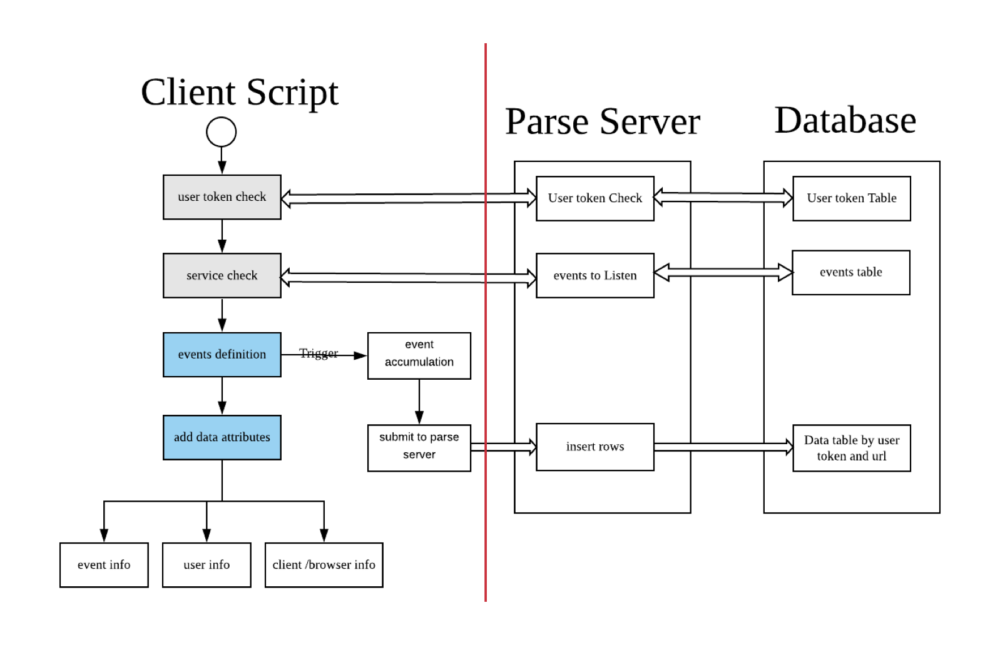

# HKUST Mouse track collection module


## 1. Mousetrack
This is a project with javascripts to collect interaction data with 
mouse/touch interaction record. 

### 1.1 How it works



## 2. Usage
### 2.1 Backend
#### 2.1.1 MongoDB required
* You need to install a MongoDB first because we need it to store data (In 2.1.3).
* Start and test your MongoDB, make sure it run well.

#### 2.1.2 Parse server, choose 1 solution
###### Solution 1
* Use code (server folder) in this repository
###### Solution 2
* Clone a parse server example

        $ git clone https://github.com/parse-community/parse-server-example

#### 2.1.3 Open app.js in parse server
Replace the following keys with __yours__ in app.js and app.json
* databaseURI
* appId
* masterKey
* serverURL

###### Https related
Currently only support http.

#### 2.1.4 Start parse server
* Start your parse server with npm start.
    ```$ npm start```

* If you want to run it in background.
    ```$ nohup npm start &```

### 2.2 Scripts
* We config mongodb collection, script path, appname(appId in parse server) and appkey(masterKey in parse server)
* Append the following code to your frontend of the footer in html.

        <script id="script_mousetrack" 
        collection="collectionName" 
        src="http://**YOUR PATH**/mousetrack.js"
        appname="appname"
        appkey="appkey"
        parseserver="http://**YOUR PATH**/parse"
        ></script>


##### Connection or help in collecting mouse interaction
    hweiad[AT]connect.ust.hk

##### If you find this tool can be useful in your research, please consider citing:

    @inproceedings{wei2020predicting,
    title={Predicting student performance in interactive online question pools using mouse interaction features},
    author={Wei, Huan and Li, Haotian and Xia, Meng and Wang, Yong and Qu, Huamin},
    booktitle={Proceedings of the Tenth International Conference on Learning Analytics \& Knowledge},
    pages={645--654},
    year={2020}
    }